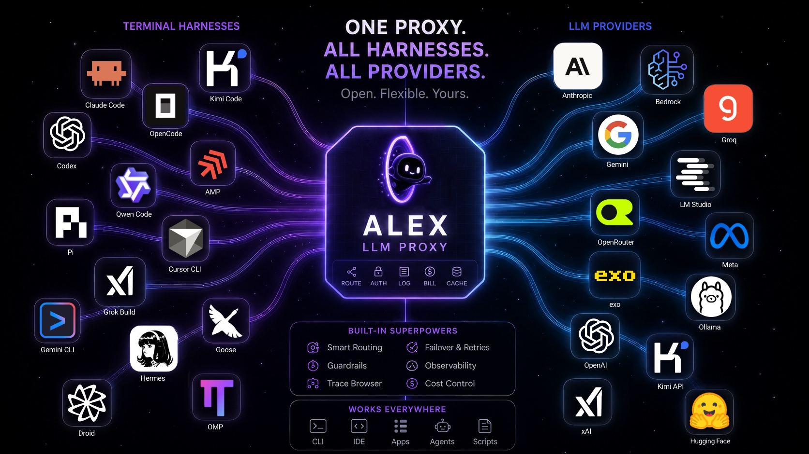
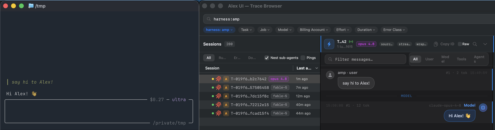
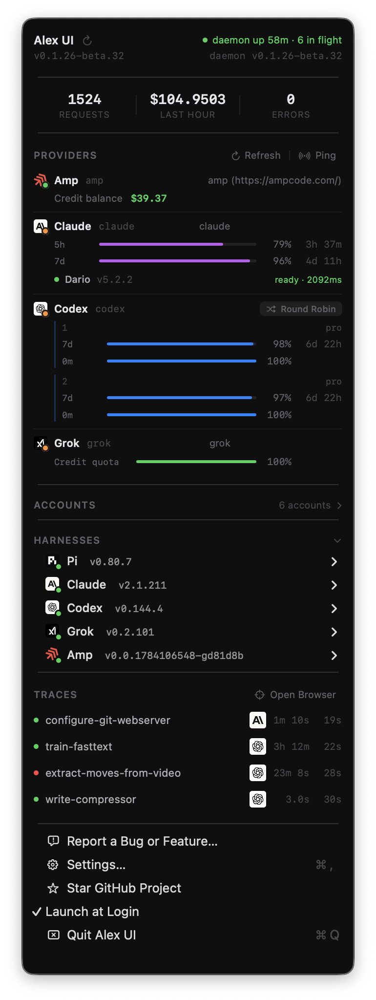
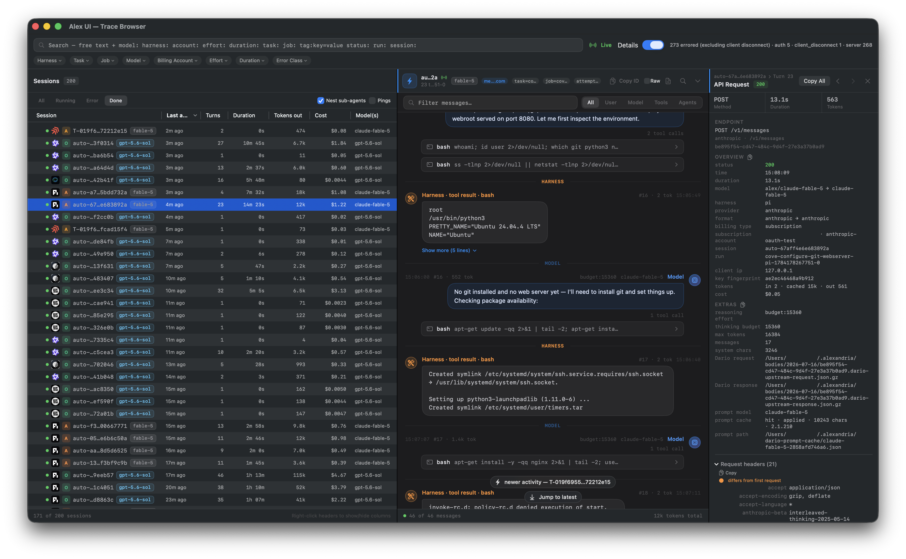
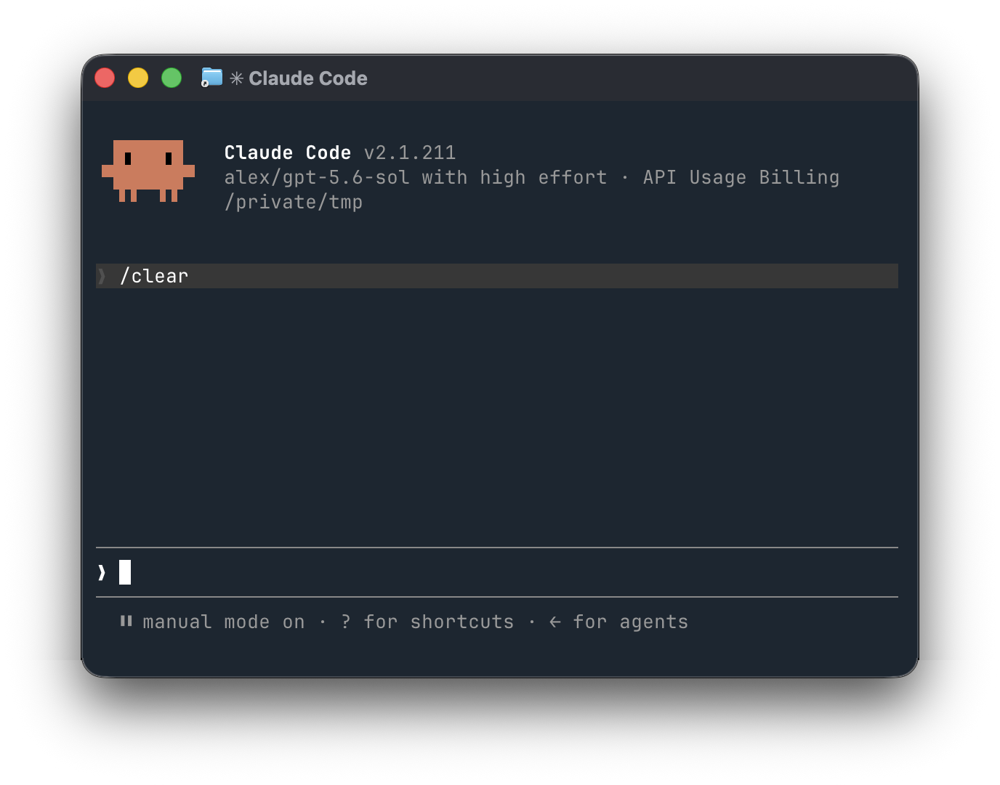
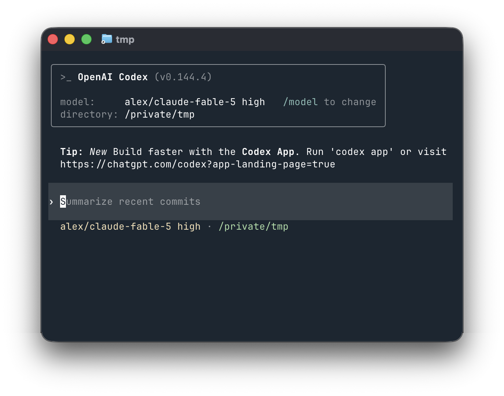
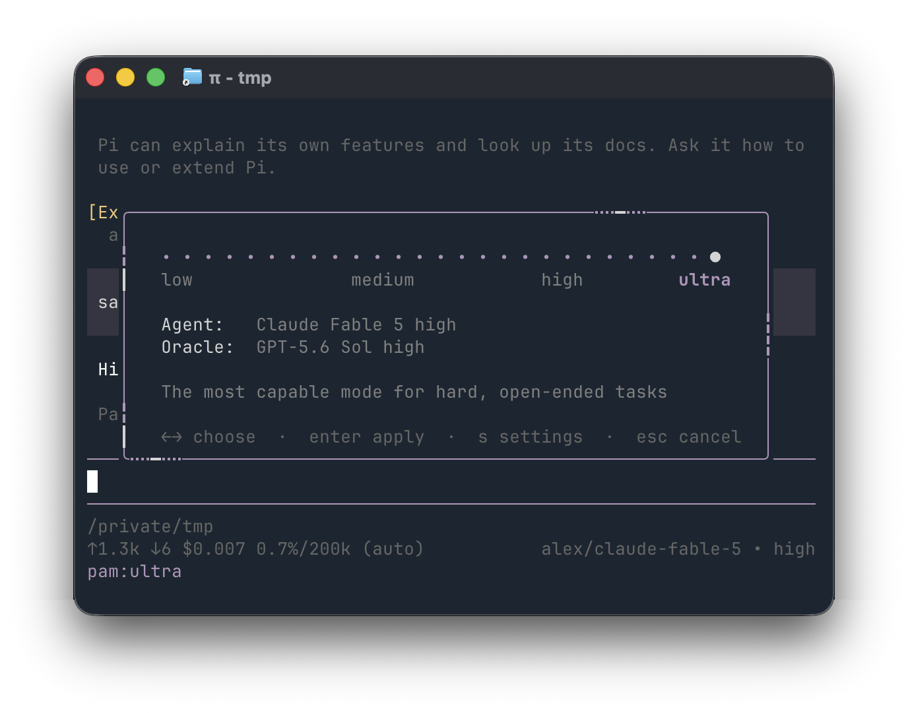
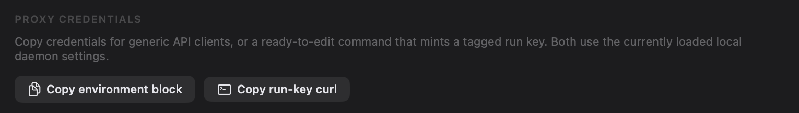

# Alex a local LLM Proxy for all token providers, APIs and harnesses

<p align="center">
  
</p>

<p align="center">
  <a href="https://crates.io/crates/alex"></a>
  <a href="https://github.com/madhavajay/alex/actions/workflows/ci.yml"></a>
  <a href="#quickstart"></a>
  <a href="#quickstart"></a>
  
</p>

<h2 align="center">Your tokens, your traces, your choice!</h2>

## e2e Harness ↔️ Provider Traces



## Quickstart

Install the macOS app or Linux daemon with one command:

```sh
curl -fsSL https://raw.githubusercontent.com/madhavajay/alex/main/install-release.sh | sh
```

## Your Tokens, Your Traces, Your Choice!

Most AI tools **lock together three things that should be separate**:

- the **harness** you work in;
- the **model** you use; and
- the **provider account** that pays for it.

**Alex separates them.**

It is a local LLM proxy that connects Claude, ChatGPT/Codex, Gemini, and Grok subscriptions or OpenRouter to a single OpenAI- and Anthropic-compatible endpoint. Point your coding tools at Alex, then choose the model you want without changing harnesses, manually managing credentials, or losing visibility into what your agents are doing.

<table align="right">
  <tr>
    <td align="center">
      
      <br>
      <sub>Inspired by <a href="https://x.com/steipete">@steipete</a>'s <a href="https://github.com/steipete/CodexBar">CodexBar</a></sub>
    </td>
  </tr>
</table>

## Why use Alex?

### At a glance

- **Use any model in any harness, like Fable 5 in Codex.**
- **See everything.** Inspect all model traffic and every turn-by-turn event.
- **Have your agents meta-analyze all your traces in an outer loop.**
- **Tokenmax across accounts.** Bond multiple subscriptions for more aggregate capacity.
- **Trace closed harnesses.** Capture activity from tools like Amp and Cursor.
- **A Rust daemon that stays up.**
- **Use Anthropic subscriptions in any tool.** Route them through [Dario](https://github.com/askalf/dario).
- **Analyze or train on your data.** Your tokens, your traces.
- **Mix and match token sources.** Combine subscriptions and providers such as OpenAI, Anthropic, Grok, and OpenRouter.

Once you use more than one coding agent or AI subscription, the setup becomes fragmented:

each harness supports different providers and API formats;
subscription credentials expire and require different login flows;
agent and subagent activity disappears across separate tools;
rate limits, usage windows, and costs are difficult to understand;
switching models often means switching the tool you work in.

Alex becomes the local control plane between your tools and your subscriptions.

Use a Claude model from Pi. Use a GPT model from Claude Code. Route across multiple Codex accounts. Capture Amp or Cursor runs that do not support custom endpoints. Inspect every model request and executed tool call in one trace browser.

<br clear="right">



### Harness tracing support

Alex records a trace for every request from any supported harness. **Session grouping** stitches a harness's
requests into one conversation; **subagent tracing** additionally reconstructs the parent→child tree when a
harness spawns subagents.

| Harness | Session grouping | Subagent tracing |
| --- | --- | --- |
| `claude` (Claude Code) | Per-agent, via `x-claude-code-agent-id` | ✅ **Full** — parent/child lineage from `x-claude-code-parent-agent-id` (recorded as `SubagentStart`/`SubagentStop`) |
| `codex` | Conversation affinity (`conversation_id`) | ⏳ Planned |
| `pi` | Session id / request metadata | ⏳ Planned |
| `gemini`, `grok`, `amp`, `cursor`, `droid`, `goose`, `kimi`, `qwen`, `opencode`, `mini-swe-agent`, `hermes`, `pydantic-ai`, `opensage`, `stirrup`, `jcode`, `omp` | Grouped by any session/`conversation_id` the tool sends, otherwise an `auto-<hash>` session per connection | ⏳ Planned |

**Today, Claude Code is the only harness with true subagent tracing** — it's the only one that emits the agent
lineage headers Alex needs. Harnesses that send no session id (e.g. Qwen Code driving a benchmark) get an
`auto-<hash>` session per connection, so many parallel/retried runs surface as many short sessions rather than one
grouped job. Broader subagent capture across harnesses is on the roadmap.

## What makes Alex different?

Use subscriptions, not only API keys.
Alex imports and refreshes credentials from the official Claude, Codex, Gemini, and Grok CLIs, allowing compatible tools to use the subscriptions you already pay for.

Any supported model from any compatible harness.
Alex translates between Anthropic Messages, OpenAI Chat Completions, OpenAI Responses, and Gemini generateContent, including streaming responses.

## Examples

| Terminal | Description |
| --- | --- |
|  | **GPT-5.6 in Claude Code.** Mix OpenAI models into an Anthropic-native harness. |
|  | **Fable 5 in Codex.** You should be able to run Fable 5 in any harness. Your tokens your choice! |
|  | **PAM in Pi.** Experiment with custom MoA plugins like PAM (the AMP Dial). |

A complete record of agent work.
Requests, responses, token usage, latency, cost, sessions, subagents, requested tools, and executed tool results can all be captured locally and inspected as a coherent transcript.

Local and inspectable by default.
The daemon listens on 127.0.0.1, stores traces in local SQLite, and keeps provider credentials on your machine.

Built for real multi-agent workflows.
Scoped run keys, session tagging, remote trace ingestion, account routing, rate-limit failover, harness integrations, and regression tests make Alex useful beyond simple API forwarding.

One operational view across providers.
The CLI and macOS menu bar app show account health, authentication failures, subscription usage windows, reset times, routing state, and live traffic.

alex auth import
alex daemon --background
alex harness connect pi
pi --model alex/gpt-5.6-sol

One proxy. Your subscriptions. Any harness. Every trace.


## How to use Alex Wrap on AMP or Cursor

### Capture traces from Amp, Cursor, and other wrapped harnesses

Harnesses that don't take a custom endpoint are captured with a reverse wrap: full
conversation traces, no config changes to the tool:

```bash
alex wrap amp   -- -x 'refactor the auth module'      # Amp, fully traced
alex wrap agent -- --print 'summarize this repo'      # Cursor Agent, fully traced
```

## From installed to working

After running the installer, import your existing CLI logins, start Alex, and connect a harness:

```bash
alex auth import
alex daemon --background
alex status

alex connect pi
pi --model alex/gpt-5.6-sol
```

`alex status` shows daemon health, accounts, limits, and Dario state. For a guided setup that can install, connect, configure, and launch a supported harness, run `alex up pi`.

## Compatibility

### API formats

Alex translates requests, responses, and streaming events between the API format sent by the client and the provider selected by the model name.

| Client API | Alex endpoint | Supported upstreams |
| --- | --- | --- |
| Anthropic Messages | `POST /v1/messages` | Anthropic, OpenAI, Gemini |
| OpenAI Chat Completions | `POST /v1/chat/completions` | Anthropic, OpenAI, Gemini, xAI |
| OpenAI Responses | `POST /v1/responses` | Anthropic, OpenAI, Gemini |
| Gemini generateContent | `POST /v1beta/models/{model}:generateContent` | Anthropic, OpenAI, Gemini |

### Harness support

| Harness | Custom models | Full trace | Executed tools |
| --- | --- | --- | --- |
| Pi | Yes | Yes | Yes |
| Claude Code | Yes | Yes | Yes |
| Codex | Yes | Yes | Yes |
| Amp | Wrapped | Yes | Yes |
| Cursor Agent | Wrapped | Yes | Partial |

Amp and Cursor use `alex wrap` because they do not expose a normal custom model endpoint. Executed-tool detail depends on what each harness exposes. Cursor currently provides requested calls without complete execution results.

## Requested tools and executed tools are different

**See what agents actually did, not only what models requested.**

A model trace may contain a request such as `call_tool("edit_file", ...)`, but that does not prove the harness executed it. On supported integrations, Alex captures harness execution events alongside model traffic, including the tool name, arguments, result, failure status, and corresponding conversation turn when the harness exposes them.

## Get proxy credentials from the UI or CLI



The macOS app can copy a complete environment block for generic API clients or a ready-to-edit command for minting a tagged run key. The CLI prints the same connection exports with `alex credentials`, also available as `alex creds`:

```bash
alex credentials

# Output shape, with the credential redacted here:
export ANTHROPIC_BASE_URL=http://127.0.0.1:4100
export ANTHROPIC_API_KEY=<local-key>
export OPENAI_BASE_URL=http://127.0.0.1:4100/v1
export OPENAI_API_KEY=<local-key>
export XAI_API_KEY=<local-key>
export GROK_MODELS_BASE_URL=http://127.0.0.1:4100/v1
export GOOGLE_GEMINI_BASE_URL=http://127.0.0.1:4100
export GOOGLE_GENAI_API_VERSION=v1beta
export GEMINI_API_KEY=<local-key>
export GEMINI_API_KEY_AUTH_MECHANISM=bearer
export GOOGLE_GENAI_USE_GCA=false
```

The local key has administrative access to your daemon. Keep it on the local machine. For a model-only, tagged credential, prefer the CLI:

```bash
alex keys mint \
  --kind run \
  --run-id demo-run-001 \
  --tag harness=pi \
  --tag project=my-project \
  --ttl 24h \
  --label 'example tagged run'
```

The equivalent HTTP request is:

```bash
curl -sS -X POST \
  -H 'x-api-key: <local-key>' \
  -H 'content-type: application/json' \
  --data '{"run_id":"demo-run-001","tags":{"harness":"pi","project":"my-project"},"ttl_seconds":86400,"label":"example tagged run"}' \
  'http://127.0.0.1:4100/admin/run-keys'
```

Run keys are shown once. Store them as secrets and revoke them with `alex keys revoke <key-id>` when they are no longer needed.

## Give your agents access to traces

A trusted local agent can use the trace API as an outer loop over previous work. It can find recurring failures, compare models and harnesses, inspect what tools actually ran, and prepare trace data for analysis or training.

Set the daemon URL and local key copied from the UI or `alex credentials`:

```bash
export ALEX_URL=http://127.0.0.1:4100
export ALEX_TRACE_KEY='<local-key>'
```

Then let the agent query the API:

```bash
# Find recent failures
curl -sS -H "x-api-key: $ALEX_TRACE_KEY" \
  "$ALEX_URL/traces/search?since=24h&errors=1&limit=100"

# Read a complete turn-by-turn transcript, including executed tools
curl -sS -H "x-api-key: $ALEX_TRACE_KEY" \
  "$ALEX_URL/traces/sessions/<session-id>/transcript"

# Search request and response text
curl -sS -H "x-api-key: $ALEX_TRACE_KEY" \
  "$ALEX_URL/traces/search?text=authentication&limit=100"

# Inspect the exact client request or model response
curl -sS -H "x-api-key: $ALEX_TRACE_KEY" \
  "$ALEX_URL/traces/<trace-id>/body/request"
curl -sS -H "x-api-key: $ALEX_TRACE_KEY" \
  "$ALEX_URL/traces/<trace-id>/body/response"

# Export traces as NDJSON for analysis, evals, or training
curl -sS -H "x-api-key: $ALEX_TRACE_KEY" \
  "$ALEX_URL/traces/export.ndjson?since=24h&bodies=1" > traces.ndjson
```

Trace-read endpoints currently require the local administrative key. Only give that key to a trusted agent running on the same machine or across a secured connection. Model-only, harness, and wrap keys cannot read trace history.

## Remote agents and scoped keys

Alex can act as a control plane for agents on other machines. Mint a model-only run key on the Alex host, then configure the remote harness:

```bash
alex up codex \
  --url https://alex.example.net \
  --key '<model-only-scoped-key>'
```

- Model-only run keys can invoke models but cannot administer Alex or read traces.
- Harness keys can submit lifecycle and executed-tool events but cannot administer the daemon.
- Wrap keys can upload traces but cannot invoke models or browse existing traces.
- Remote wrapped sessions spool locally when the central daemon is unavailable and can be replayed with `alex traces push`.
- Use HTTPS or an encrypted private network such as Tailscale for remote access.

Create an ingest-only wrap credential on the central machine with:

```bash
alex keys mint --kind wrap --label remote-mac
```

## Local and secure by default

- Alex listens only on `127.0.0.1` unless you explicitly configure another interface.
- Traces are stored locally in SQLite, with large bodies kept in the local data directory.
- Provider and harness credentials stay on your machine with restricted file permissions.
- Scoped credentials separate model access, harness events, and remote trace ingestion.
- Alex does not require Alex-operated cloud infrastructure.

Binding Alex to `0.0.0.0` exposes the proxy to the network. Only do this with appropriate authentication and firewall rules, preferably behind TLS or an encrypted private network. Never give a remote worker the local administrative key.

## Tokenmax across accounts

Bond multiple accounts using `round_robin`, `priority`, or `reset_first` routing. When an account reaches a rate limit, Alex can cool it down and route eligible traffic through another account. The CLI and app expose utilization and reset windows so routing decisions remain visible.

## Reliability

The Rust daemon includes the operational behavior needed for long-running agent work:

- automatic OAuth token refresh;
- provider health checks and authentication-error classification;
- account cooldown and failover after rate limits;
- graceful draining of in-flight requests during supported updates and restarts;
- subscription utilization and reset-window visibility; and
- local spooling when a remote trace destination is unavailable.

### Error simulation lab and opt-in protection

Capture a real error body as a named fixture, then inject it into the next
request for a live session without exposing a simulation header to the harness:

```bash
alex fixtures list
alex simulate inject <session-id> anthropic-relogin-401
alex simulate pending <session-id>
```

Fixtures live under `<data_dir>/fixtures`; the daemon seeds a small starter
library on first use. The admin API is local-key gated. Cross-provider
protection is opt-in; ordinary account failover remains limited to capacity and
server errors. The symmetric Claude/OpenAI example can be installed with
`alex protection preset anthropic-openai` (it does not enable protection):

```toml
# [protection]
# enabled = true
# reroute_on_auth = true # explicitly permit auth/subscription failover
# retries = 1
# auto_return = true
#
# [protection.equivalencies]
# "claude-fable-5" = { openai = "gpt-5.6-sol" }
# "gpt-5.6-sol" = { anthropic = "claude-fable-5" }
```

Even with protection enabled, a single request can demand the exact model it
asked for: send `x-alexandria-no-substitute: 1` to disable both account failover
and cross-provider substitution for that call, so the real model is used and the
real error (if any) is returned unchanged. This is intended for **benchmark
suites** that must run against a specific model (e.g. `claude-fable-5`) and must
never be silently rerouted.

### Optional request headers

Any harness pointed at Alex can set these per request:

- `x-alexandria-no-substitute: 1` — pin the model: disable failover and
  cross-provider substitution, returning the real response or the real error
  (benchmarks).
- `x-session-id: <id>` — group requests into one session/transcript.
- `x-alexandria-run-id: <id>` — attach your own external run id for correlation.
- `x-alexandria-trace-tag`, `x-alexandria-job`, `x-alexandria-task`,
  `x-alexandria-phase` — tag traces for later filtering and analytics.
- `x-alexandria-harness`, `x-alexandria-harness-version` — label the calling
  harness in traces.
- `x-alexandria-simulate-error: STATUS[:kind]` — return a synthetic error with no
  upstream call, for testing harness and failover behavior (local/harness-key
  gated).

## Platforms and alternative installation

macOS and Linux are the supported platforms. Windows x86-64 CLI builds are published with releases, but they are experimental. First-class Windows support, including service integration, is coming soon.

Alternative installation methods:

```bash
brew install madhavajay/alex/alex               # CLI and daemon
brew install --cask madhavajay/alex/alexandria  # macOS menu bar app
cargo install alex                              # CLI from crates.io
./install.sh --service                          # build this checkout and install its service
```

## Workspace

| Crate | Purpose |
| --- | --- |
| [`alex`](crates/alex) | Daemon and CLI binaries |
| [`alex-core`](crates/alex-core) | Routing, translation, quota, and pricing logic |
| [`alex-auth`](crates/alex-auth) | Credential vault and login flows |
| [`alex-store`](crates/alex-store) | SQLite traces and analytics |
| [`alex-proxy`](crates/alex-proxy) | API ingress, admin API, and upstream clients |
| [`alex-wrap`](crates/alex-wrap) | Reverse wrapping and capture for closed harnesses |

## Development

```bash
./test.sh
./scripts/harness-regression.sh
cd macos && swift test
```

## Contributing

Bug reports, ideas, and feature requests are welcome through [GitHub Issues](https://github.com/madhavajay/alex/issues/new).

Built by [madhavajay](https://github.com/madhavajay). Follow [@madhavajay](https://x.com/madhavajay) on X.

## License

Dual-licensed under [MIT](LICENSE-MIT) or [Apache-2.0](LICENSE-APACHE), at your option.
